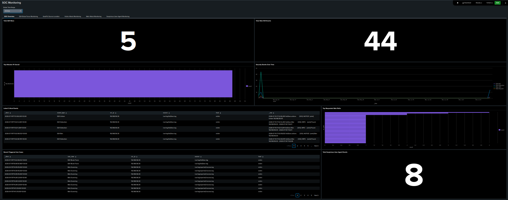
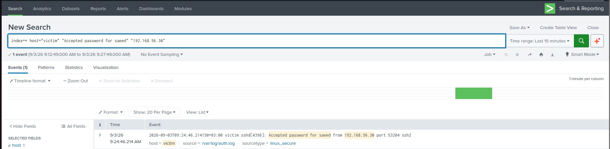
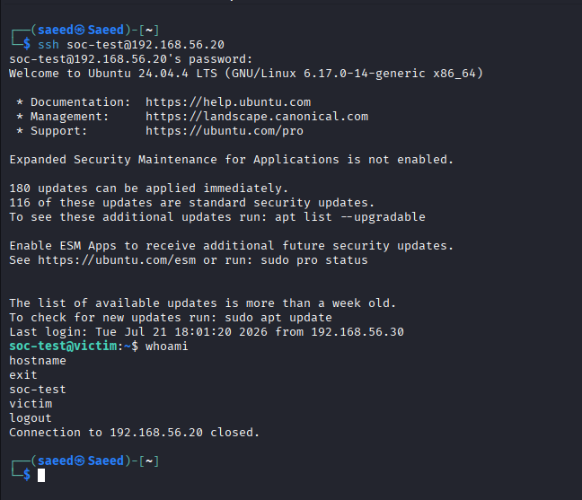
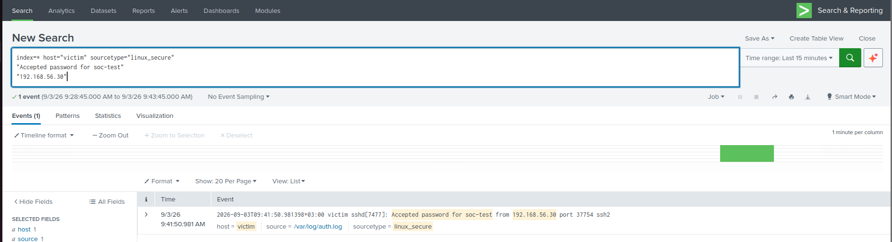
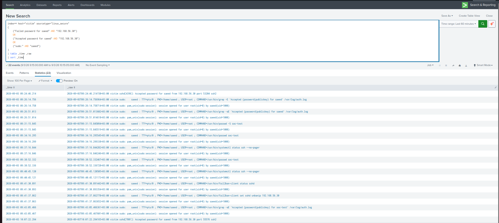

# Mini SOC Monitoring Lab with Splunk

[Use-case roadmap](use-cases/README.md) · [Architecture](docs/architecture/README.md) · [Setup](docs/setup/README.md) · [Automation](automation/n8n/README.md) · [Evidence index](docs/evidence-index.md)

> UC-01 to UC-05 contain existing lab material. UC-06 to UC-48 are planned templates. This restructuring did not repeat live Splunk validation; the existing technical descriptions and validation statements are retained.

## Overview

This project presents a hands-on Mini SOC Monitoring Lab built with Splunk to simulate real-world security monitoring and incident investigation workflows. The lab focuses on centralized log collection, detection engineering, alerting, event correlation, IOC extraction, incident investigation, MITRE ATT&CK mapping, and SOC-style incident documentation.

The environment consists of an Ubuntu-based Splunk server, an Ubuntu victim machine, and a Kali Linux attacker machine operating inside an isolated VirtualBox lab network.

The current detection use cases focus on:

- Detecting repeated SSH authentication failures
- Correlating failed SSH attempts followed by successful authentication
- Detecting successful SSH access followed by sudo execution and root-level privilege escalation
- Detecting repeated failed sudo authentication attempts
- Detecting successful SSH authentication to privileged or sensitive Linux accounts

## Lab Environment

| Component | Operating System | Role |
|---|---|---|
| Splunk Server | Ubuntu Server 22.04 | Centralized log collection, analysis, alerts, and dashboards |
| Victim Machine | Linux | Monitored target that generates authentication logs |
| Kali Linux | Kali Linux | Controlled attack simulation machine |

## Tools Used

- Splunk Enterprise
- Splunk Universal Forwarder
- Ubuntu Server
- Kali Linux
- Linux authentication logs
- SPL
- Hydra
- SSH
- sudo
- Fail2Ban
- VirtualBox
- Docker
- n8n
- Webhooks
- Telegram Bot

## Detection Use Cases

### 1. SSH Brute Force Detection

This detection identifies repeated failed SSH login attempts originating from the same source IP address within a short time window.

| Setting | Value |
|---|---|
| Failure threshold | 5 attempts |
| Search window | Last 5 minutes |
| Severity | Medium |
| Validation result | Triggered successfully |

### 2. SSH Brute Force Followed by Successful Login

This detection correlates repeated failed SSH password attempts with a subsequent successful login from the same source IP address and against the same account.

| Setting | Value |
|---|---|
| Failure threshold | 5 attempts |
| Correlation window | Last 10 minutes |
| Severity | High |
| Validation result | Triggered successfully |

### 3. SSH Successful Login Followed by Privilege Escalation

This detection correlates a successful SSH password login with subsequent sudo command execution and the opening of a root session for the same Linux account.

| Setting | Value |
|---|---|
| Correlation sequence | SSH login → sudo command → root session |
| Internal correlation limit | 600 seconds |
| Scheduled search range | Last 15 minutes |
| Schedule | Every 5 minutes |
| Severity | Critical |
| Throttle | 15 minutes |
| Validation result | Triggered successfully |

### 4. Multiple Failed sudo Attempts

This detection identifies repeated failed `sudo` authentication attempts on a Linux host and alerts when three or more incorrect sudo password attempts are recorded.

| Setting | Value |
|---|---|
| Failure threshold | 3 incorrect sudo password attempts |
| Search window | Last 5 minutes |
| Schedule | Every 5 minutes |
| Severity | Medium |
| Validation result | Triggered successfully |
| Privilege-escalation outcome | No successful sudo session observed |

### 5. Successful Login to a Privileged or Sensitive Account

This detection identifies successful SSH authentication to Linux accounts classified as privileged or sensitive through a Splunk lookup.

The validated lookup currently classifies `saeed` as a privileged `sudo` account and `root` as a sensitive root account.

| Setting | Value |
|---|---|
| Authentication methods | Password or public key |
| Account classification | `privileged_accounts.csv` lookup |
| Search window | Last 5 minutes |
| Schedule | Every 5 minutes |
| Severity | High |
| Trigger mode | For each result |
| Throttle | 15 minutes by `user,src_ip` |
| Validation result | Triggered successfully |
| Negative test | Non-privileged `soc-test` login excluded |

## MITRE ATT&CK Mapping

| Use Case | Tactic | Technique | Sub-technique |
|---|---|---|---|
| SSH Brute Force Detection | Credential Access (`TA0006`) | Brute Force (`T1110`) | Password Guessing (`T1110.001`) |
| SSH Brute Force Followed by Successful Login | Credential Access (`TA0006`) | Brute Force (`T1110`) | Password Guessing (`T1110.001`) |
| SSH Login Followed by Privilege Escalation | Privilege Escalation (`TA0004`) | Abuse Elevation Control Mechanism (`T1548`) | Sudo and Sudo Caching (`T1548.003`) |
| Multiple Failed sudo Attempts | Privilege Escalation (`TA0004`) | Abuse Elevation Control Mechanism (`T1548`) | Sudo and Sudo Caching (`T1548.003`) |
| Successful Login to a Privileged or Sensitive Account | Initial Access (`TA0001`), Persistence (`TA0003`), Privilege Escalation (`TA0004`), Defense Evasion (`TA0005`) | Valid Accounts (`T1078`) | Local Accounts (`T1078.003`) |

Related techniques:

**Use Case 03**
- Remote Services: SSH (`T1021.004`)
- Valid Accounts: Local Accounts (`T1078.003`)

**Use Case 05**
- Remote Services: SSH (`T1021.004`) — Lateral Movement (`TA0008`)

## SOC Alert Automation

The Mini SOC lab also includes a validated security automation workflow that extends Splunk alerting with automated analyst notification.

The automation uses **n8n** to receive triggered Splunk alerts through a webhook, reduce duplicate processing, and deliver structured SOC notifications through Telegram.

### Automation Architecture

```text
Linux Security Event
        |
        v
Splunk Universal Forwarder
        |
        v
Splunk Enterprise
        |
        v
SPL Detection
        |
        v
Scheduled Alert
        |
        v
Splunk Webhook Alert Action
        |
        v
n8n Webhook
        |
        v
Remove Duplicates
        |
        v
Telegram Bot
        |
        v
SOC Analyst Notification
```

### Validated Automation

The first detection integrated with the automation workflow is:

**SSH Brute-Force Detection**

The end-to-end workflow was successfully validated:

| Stage | Status |
|---|---|
| Splunk detection | Validated |
| Scheduled alert | Validated |
| Webhook alert action | Validated |
| n8n webhook reception | Validated |
| Duplicate filtering | Validated |
| Telegram execution | Validated |
| Analyst notification | Validated |

The automation extends the original SOC workflow from:

```text
Detection → Alert → Manual Review
```

to:

```text
Detection → Alert → Automation → Notification → Investigation
```

### Automation Workflow

The implemented n8n workflow contains:

```text
Webhook
   |
   v
Remove Duplicates
   |
   v
Telegram
```

A sanitized version of the workflow is available for review and import:

- [Sanitized n8n Workflow](automation/n8n/workflows/ssh-brute-force-telegram.json)

### Automation Documentation

- [SOC Alert Automation Overview](automation/n8n/README.md)
- [n8n Installation](automation/n8n/n8n-installation.md)
- [Splunk Webhook Integration](automation/n8n/splunk-webhook-integration.md)
- [n8n Workflow Design](automation/n8n/workflow-design.md)
- [Telegram Integration](automation/n8n/telegram-integration.md)
- [End-to-End Validation](automation/n8n/validation.md)

### Automation Evidence

The repository includes screenshots demonstrating:

- n8n running inside Docker
- n8n web interface availability
- Splunk Webhook alert action
- Successful Splunk-to-n8n webhook reception
- Successful n8n workflow execution
- Duplicate filtering
- Successful Telegram node execution
- Final SOC alert delivered to Telegram

[View additional project evidence](docs/evidence-index.md)

> Sensitive credentials, Telegram tokens, Chat IDs, webhook identifiers, and environment-specific IDs were removed or redacted before publication.

## Project Contents

- Mini SOC lab architecture
- Lab setup guide
- Centralized Linux log collection
- SPL detection and correlation queries
- Scheduled alert configurations
- SSH brute-force simulation
- Failure-to-success authentication correlation
- SSH-to-root privilege-escalation correlation
- Multiple failed sudo authentication detection
- sudo authentication failure investigation
- Privileged and sensitive account login detection
- Lookup-based privileged account classification
- Positive and negative detection testing
- Alert throttling and duplicate suppression
- Alert investigation and IOC extraction
- SOC-style incident reports
- MITRE ATT&CK mapping
- SOC monitoring dashboard
- Validation screenshots
- Lessons learned
- Splunk-to-n8n webhook integration
- n8n SOC alert automation workflow
- Duplicate alert processing control
- Telegram analyst notifications
- End-to-end automation validation
- Sanitized reusable n8n workflow template

## What I Learned

- Collecting and analyzing Linux authentication logs
- Configuring Splunk Universal Forwarder
- Writing SPL queries for SSH detections
- Extracting fields from raw events using `rex`
- Handling compressed `message repeated` events
- Correlating failed and successful authentication events
- Correlating SSH, sudo, and root-session events
- Detecting repeated failed sudo authentication attempts
- Detecting successful SSH authentication to privileged or sensitive accounts
- Maintaining privileged account classifications with a Splunk lookup
- Extracting sudo failure counts from Linux authentication logs using SPL
- Investigating whether failed sudo attempts were followed by a successful privileged session
- Using `streamstats` to preserve chronological event context
- Returning separate results for independent escalation sequences
- Creating scheduled Splunk alerts
- Assigning severity based on detection context
- Testing detections using positive and negative scenarios
- Preventing duplicate alerts using throttling
- Investigating alerts and extracting indicators
- Reviewing successful authentication after repeated failures
- Investigating root-level command execution
- Creating SOC monitoring dashboards
- Writing SOC-style incident reports
- Mapping detections to MITRE ATT&CK
- Testing queries manually before configuring alerts
- Integrating Splunk alerts with external automation platforms
- Using webhooks for SIEM alert orchestration
- Building security automation workflows with n8n
- Reducing duplicate automated notifications
- Delivering structured SOC alerts through Telegram
- Separating SIEM detection from notification automation
- Sanitizing automation workflows before publishing them publicly

## Disclaimer

This project was built in a controlled and isolated lab environment for educational and portfolio purposes only.

All authentication, privilege-escalation, and attack-simulation activity was performed against systems owned by the tester. No public, production, or unauthorized systems were targeted.

## Repository Structure

- `README.md`
- `docs/`: architecture, setup, lessons, references, and the preserved evidence index.
- `use-cases/`: the roadmap and six phase indexes; each use case keeps its documentation, detection, alert configuration, incident report, and evidence together.
    - `phase-01-ssh-authentication/` — UC-01 to UC-05
    - `phase-02-linux-post-compromise/` — UC-06 to UC-15
    - `phase-03-defensive-response/` — UC-16 to UC-20
    - `phase-04-web-monitoring/` — UC-21 to UC-29
    - `phase-05-network/` — UC-30 to UC-35
    - `phase-06-windows-sysmon/` — UC-36 to UC-48
- `automation/n8n/`: the existing automation documents, workflow JSON, and execution evidence.
- `dashboards/`: dashboard documentation and evidence.
- `templates/`: use-case, alert, incident, and evidence templates.
- `scripts/validate-repository.py`: local structure and link checks.
- `.github/workflows/repository-checks.yml`: runs the same checks in GitHub Actions.
- `.gitignore`
- `CONTRIBUTING.md`

The complete directory listing is available in [Repository Structure](docs/repository-structure.md).

## Documentation

### Lab Documentation

- [Lab Architecture](docs/architecture/README.md)
- [Lab Setup Guide](docs/setup/README.md)
- [Lessons Learned](docs/lessons-learned.md)

### SSH Brute-Force Detection

- [SSH Brute-Force Detection Use Case](use-cases/phase-01-ssh-authentication/uc-01-ssh-bruteforce/README.md)
- [SSH Brute-Force Alert Configuration](use-cases/phase-01-ssh-authentication/uc-01-ssh-bruteforce/alert-configuration.md)
- [SSH Brute-Force Detection Query](use-cases/phase-01-ssh-authentication/uc-01-ssh-bruteforce/detection.spl)
- [SSH Brute-Force Incident Report](use-cases/phase-01-ssh-authentication/uc-01-ssh-bruteforce/incident-report.md)

### SSH Failure-to-Success Detection

- [SSH Failure-to-Success Detection Use Case](use-cases/phase-01-ssh-authentication/uc-02-ssh-failure-to-success/README.md)
- [SSH Failure-to-Success Alert Configuration](use-cases/phase-01-ssh-authentication/uc-02-ssh-failure-to-success/alert-configuration.md)
- [SSH Failure-to-Success Detection Query](use-cases/phase-01-ssh-authentication/uc-02-ssh-failure-to-success/detection.spl)
- [SSH Failure-to-Success Incident Report](use-cases/phase-01-ssh-authentication/uc-02-ssh-failure-to-success/incident-report.md)

### SSH Privilege-Escalation Detection

- [SSH Privilege-Escalation Detection Use Case](use-cases/phase-01-ssh-authentication/uc-03-ssh-privilege-escalation/README.md)
- [SSH Privilege-Escalation Alert Configuration](use-cases/phase-01-ssh-authentication/uc-03-ssh-privilege-escalation/alert-configuration.md)
- [SSH Privilege-Escalation Detection Query](use-cases/phase-01-ssh-authentication/uc-03-ssh-privilege-escalation/detection.spl)
- [SSH Privilege-Escalation Incident Report](use-cases/phase-01-ssh-authentication/uc-03-ssh-privilege-escalation/incident-report.md)

### Multiple Failed sudo Attempts

- [Multiple Failed sudo Attempts Use Case](use-cases/phase-01-ssh-authentication/uc-04-failed-sudo/README.md)
- [Multiple Failed sudo Attempts Alert Configuration](use-cases/phase-01-ssh-authentication/uc-04-failed-sudo/alert-configuration.md)
- [Multiple Failed sudo Attempts Detection Query](use-cases/phase-01-ssh-authentication/uc-04-failed-sudo/detection.spl)
- [Multiple Failed sudo Attempts Incident Report](use-cases/phase-01-ssh-authentication/uc-04-failed-sudo/incident-report.md)

### Successful Login to a Privileged or Sensitive Account

- [Privileged Account Login Use Case](use-cases/phase-01-ssh-authentication/uc-05-privileged-login/README.md)
- [Privileged Account Login Alert Configuration](use-cases/phase-01-ssh-authentication/uc-05-privileged-login/alert-configuration.md)
- [Privileged Account Login Detection Query](use-cases/phase-01-ssh-authentication/uc-05-privileged-login/detection.spl)
- [Privileged Account Login Incident Report](use-cases/phase-01-ssh-authentication/uc-05-privileged-login/incident-report.md)
- [Privileged Accounts Lookup](use-cases/phase-01-ssh-authentication/uc-05-privileged-login/privileged_accounts.csv)

### Evidence

- [Project Screenshots and Validation Evidence](docs/evidence-index.md)

## Visual Evidence

The following dashboard provides an overview of the security events monitored inside the Mini SOC lab.



The complete validation gallery includes:

- Virtual lab architecture
- Linux log ingestion
- Raw SSH authentication events
- SPL detection results
- Alert configurations
- Triggered alerts
- Investigation evidence
- Failure-to-success authentication correlation
- SSH login followed by privilege escalation
- Critical alert and throttle validation
- Privileged account verification
- Successful privileged SSH authentication
- Non-privileged negative-test validation
- Privileged account lookup validation
- Triggered privileged-account alert
- SOC investigation timeline and context

### UC5 — Privileged Account Login Evidence

The following screenshots document the complete validation workflow for **Successful Login to a Privileged or Sensitive Account**.

#### Privileged Account Verification


#### Successful Privileged SSH Login


#### Raw Authentication Log


#### Splunk Log Ingestion



#### Non-Privileged Account Verification


#### Negative Test — Successful SSH Login



#### Negative Test — Raw Authentication Log


#### Negative Test — Splunk Ingestion



#### Negative Test — Detection Validation


#### Privileged Accounts Lookup


#### Final Detection Results


#### Alert Configuration


#### Triggered Alert


#### Triggered Alert Results


#### Investigation Timeline


#### Investigation Context



#### UC5 Evidence Summary

| Evidence | Status |
|---|---|
| Privileged account verification | Verified |
| Controlled privileged SSH login | Verified |
| Raw authentication log | Verified |
| Splunk ingestion | Verified |
| Non-privileged account validation | Verified |
| Negative test | Passed |
| Privileged account lookup | Validated |
| Final lookup-based SPL | Validated |
| Scheduled alert | Validated |
| Triggered alert | Confirmed |
| SOC investigation | Completed |

## Validated Results

### SSH Brute-Force Detection

| Field | Result |
|---|---|
| Destination host | `victim` |
| Source IP | `192.168.56.30` |
| Targeted user | `saeed` |
| Failed attempts | `6` |
| Severity | Medium |
| Alert status | Triggered successfully |

### SSH Brute Force Followed by Successful Login

| Field | Result |
|---|---|
| Destination host | `victim` |
| Source IP | `192.168.56.30` |
| Targeted account | `soc-test` |
| Failed attempts | `5` |
| Attack window | Approximately `12.69` seconds |
| Time after final failure | Approximately `6.49` seconds |
| Severity | High |
| Alert status | Triggered successfully |

### SSH Successful Login Followed by Privilege Escalation

| Field | Result |
|---|---|
| Destination host | `victim` |
| Source IP | `192.168.56.30` |
| Authenticated account | `soc-test` |
| Privileged account | `root` |
| Executed command | `/usr/bin/id` |
| First validated time to root | Approximately `11.43` seconds |
| Second validated time to root | Approximately `5.68` seconds |
| Severity | Critical |
| Alert status | Triggered successfully |
| Duplicate suppression | Verified using a 15-minute throttle |

### Multiple Failed sudo Attempts

| Field | Result |
|---|---|
| Destination host | `victim` |
| User | `saeed` |
| Failed sudo attempts | `3` |
| Requested privileged account | `root` |
| Attempted command | `/usr/bin/whoami` |
| Detection threshold | `failed_attempts >= 3` |
| Search window | Last 5 minutes |
| Schedule | Every 5 minutes |
| Severity | Medium |
| Alert status | Triggered successfully |
| Successful sudo session | Not observed |
| Privilege escalation outcome | Not successful |

### Successful Login to a Privileged or Sensitive Account

| Field | Result |
|---|---|
| Destination host | `victim` |
| Source IP | `192.168.56.30` |
| Privileged user | `saeed` |
| Account type | `Privileged Account (sudo)` |
| Authentication method | `password` |
| Triggered source port | `55576` |
| Account classification | `privileged_accounts.csv` |
| Scheduled search range | Last 5 minutes |
| Schedule | Every 5 minutes |
| Severity | High |
| Alert status | Triggered successfully |
| Negative-test account | `soc-test` |
| Negative-test result | Correctly excluded from detection |

## Validation Matrix

| Scenario | Expected Result | Actual Result | Status |
|---|---|---|---|
| Repeated failed SSH passwords | Medium alert | Medium alert | Passed |
| Failed SSH attempts followed by successful login | High alert | High alert | Passed |
| SSH login without sudo | No privilege-escalation detection | No detection | Passed |
| Local sudo without SSH login | No SSH privilege-escalation detection | No detection | Passed |
| SSH login followed by sudo and root session | Critical alert | Critical alert | Passed |
| Multiple privilege-escalation sequences | Separate results | Separate results | Passed |
| Repeated scheduled searches | Duplicate alerts suppressed | Suppressed | Passed |
| Three failed sudo password attempts | Medium alert | Medium alert | Passed |
| Failed sudo attempts followed by no successful root session | No successful privilege escalation | No successful privilege escalation | Passed |
| Successful SSH login to lookup-classified privileged account | High alert | High alert | Passed |
| Successful SSH login to non-privileged account | No UC5 detection | No detection | Passed |

## Current Project Status

Five detection use cases have been implemented, tested, investigated, validated, and documented.

Completed items:

- Mini SOC lab setup guide
- Virtual lab architecture
- Centralized Linux log collection
- Splunk Universal Forwarder configuration
- SSH brute-force simulation
- SSH brute-force detection query
- SSH failure-to-success correlation query
- SSH privilege-escalation correlation query
- Medium-severity brute-force alert
- High-severity compromise-pattern alert
- Critical privilege-escalation alert
- Positive and negative validation testing
- Multiple-sequence correlation testing
- Scheduled alert validation
- Triggered alert verification
- Fifteen-minute alert throttling
- Duplicate-alert suppression validation
- Alert investigation
- IOC extraction
- Five SOC-style incident reports
- MITRE ATT&CK mapping
- SOC monitoring dashboard
- Visual evidence gallery
- Lessons learned documentation
- Splunk-to-n8n webhook integration
- n8n SOC alert automation workflow
- Duplicate alert processing control
- Telegram SOC notification integration
- End-to-end automation validation
- Sanitized n8n workflow published for portfolio review
- Multiple failed sudo attempts detection
- Medium-severity sudo authentication alert
- Privileged and sensitive account login detection
- Lookup-based privileged account classification
- High-severity privileged account login alert
- Non-privileged account negative-test validation
- Privileged account login investigation
- sudo authentication investigation
- Validation of no successful sudo/root session
Additional detection use cases will be added only after they are configured, tested, investigated, and validated inside the lab.
