# Project Screenshots

[Project overview](../README.md) · [Use-case roadmap](../use-cases/README.md)

The existing gallery text is preserved here; image files are stored once in their corresponding use-case, setup, dashboard, or automation folders.

This index links to visual evidence documenting the Mini SOC lab architecture, Splunk log ingestion, SSH brute-force detection, failure-to-success authentication correlation, privilege-escalation detection, alert validation, investigation, and monitoring dashboard.

All displayed activity was generated inside an isolated and authorized lab environment.

## 1. Lab Virtual Machines

The VirtualBox environment includes the Splunk Server, Kali Linux attacker machine, and Ubuntu victim machine connected through the isolated `SOC-LAB` network.

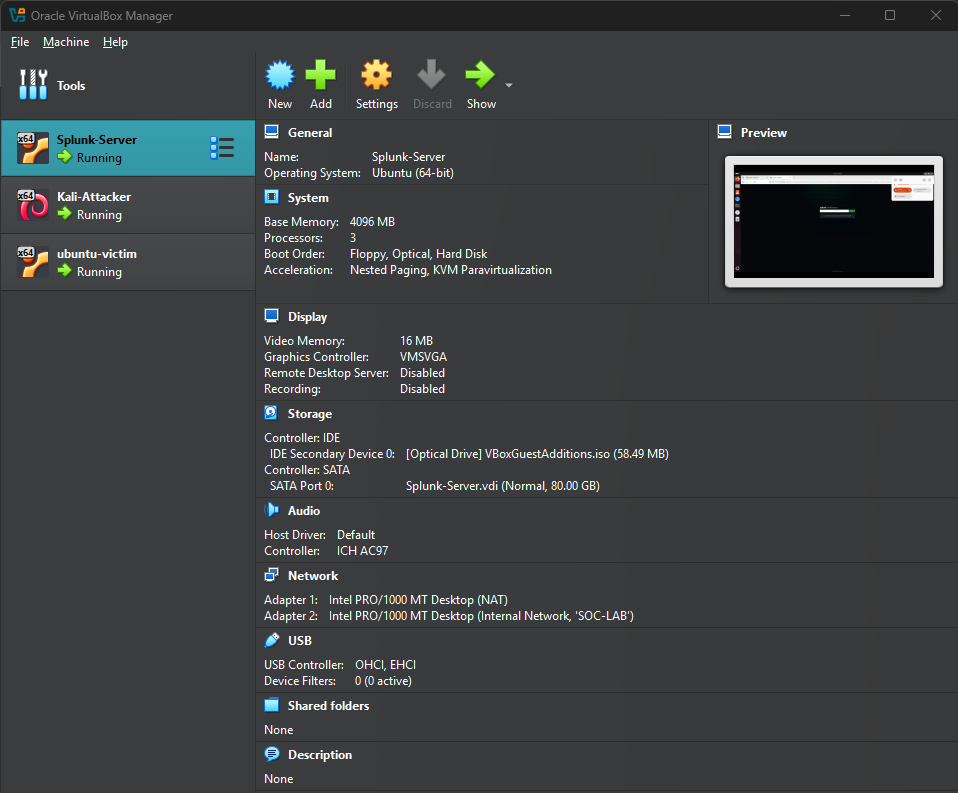

## 2. Splunk Log Ingestion

Linux authentication logs from the monitored victim machine are successfully collected and indexed in Splunk Enterprise.

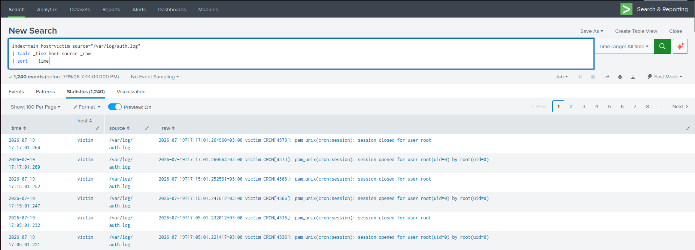

## 3. Raw SSH Brute-Force Events

Raw Linux authentication events show failed SSH passwords originating from the Kali Linux source address.

The logs include normal events and a compressed `message repeated` event.

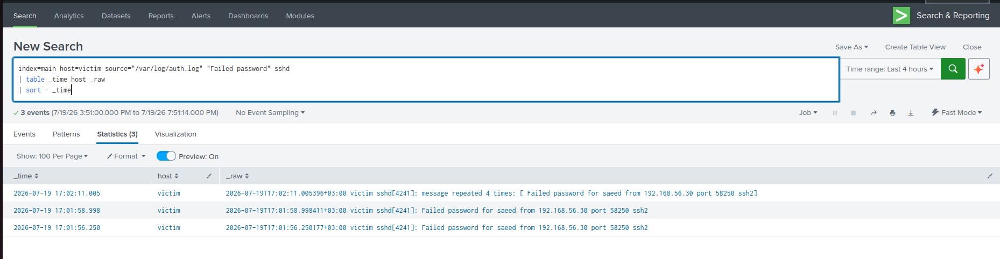

## 4. Detection Query Results

The validated SPL query extracts the source IP and targeted username, calculates repeated events, and identifies six failed authentication attempts.

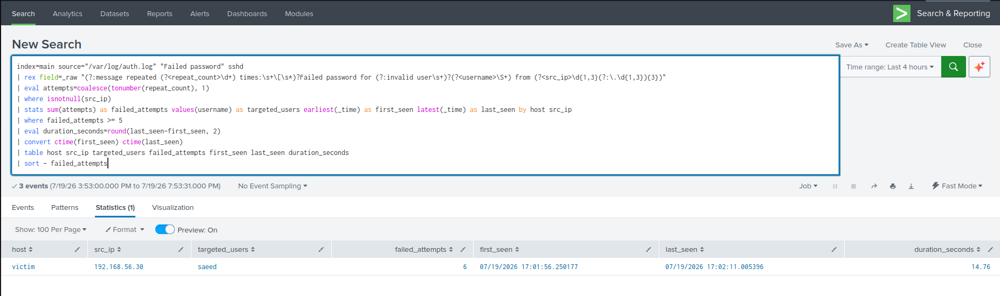

## 5. Alert Configuration

The Splunk alert is scheduled to run every five minutes and searches the previous five-minute window.

It triggers when the detection query returns one or more results and records the alert with Medium severity.

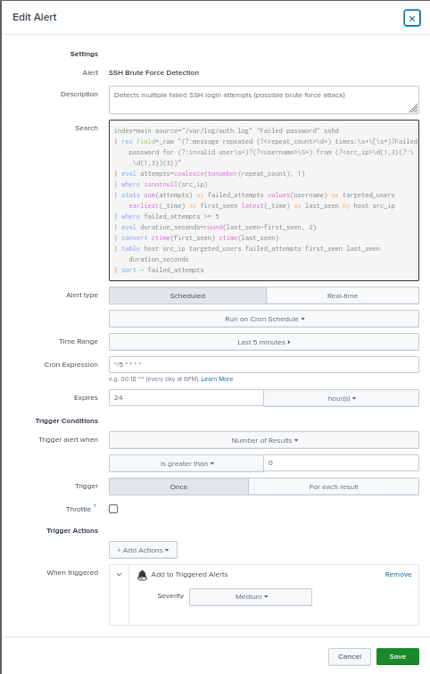

## 6. Triggered Alert

The validated SSH brute-force alert appeared successfully in the Splunk Triggered Alerts page.

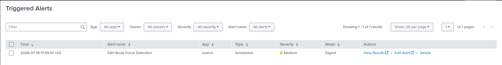

## 7. SOC Monitoring Dashboard

The SOC monitoring dashboard provides visibility into SSH detections, defensive blocks, web activity, suspicious user agents, source addresses, and recent security events.


## 8. Initial Brute-Force Investigation Evidence

The investigation search confirms that the tested source IP generated failed authentication events and that no successful SSH password authentication was observed during the test window.

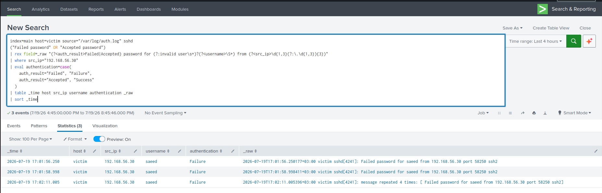

## 9. SSH Failure-to-Success Events

The raw Linux authentication events show five failed SSH password attempts against the `soc-test` account, followed by a successful password authentication from the same source IP address.

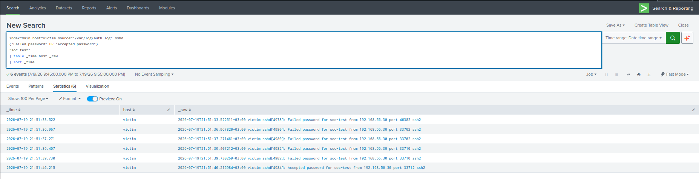

## 10. SSH Failure-to-Success Detection Results

The correlation query identified five failed authentication attempts followed by a successful login from `192.168.56.30` against the `soc-test` account.

The successful login occurred approximately `6.49` seconds after the final failed attempt, and the complete sequence occurred within approximately `12.69` seconds.

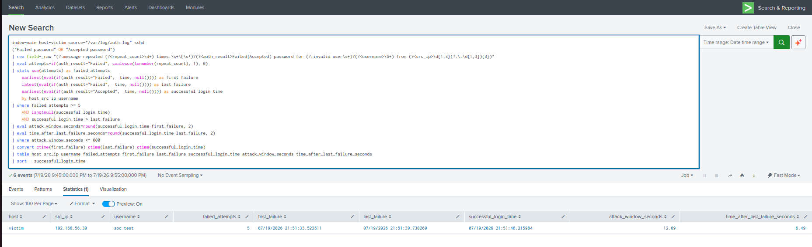

## 11. SSH Privilege-Escalation Detection Results

The validated correlation query identified successful SSH authentication followed by sudo command execution and the opening of a root session for the same Linux account.

Two independent privilege-escalation sequences were detected for the `soc-test` account originating from `192.168.56.30`.

The authorized command `/usr/bin/id` executed with root privileges. The measured times from SSH login to root-level execution were approximately `11.43` seconds and `5.68` seconds.

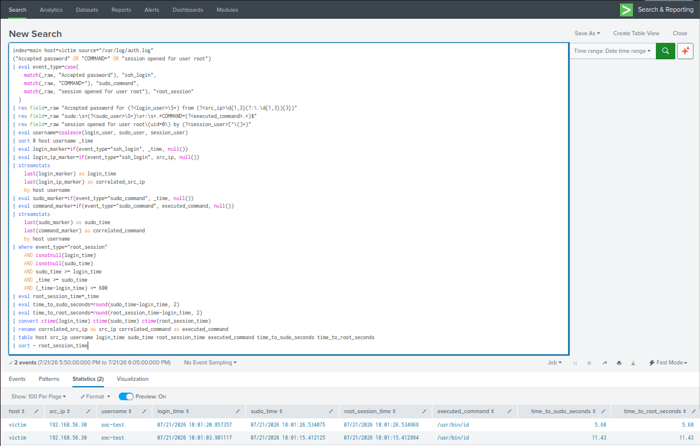

## 12. SSH Privilege-Escalation Triggered Alert

The scheduled Splunk alert triggered successfully with Critical severity after detecting a successful SSH login followed by sudo command execution and root-session creation.

A fifteen-minute throttle was enabled and validated to suppress duplicate alerts caused by overlapping scheduled search windows.

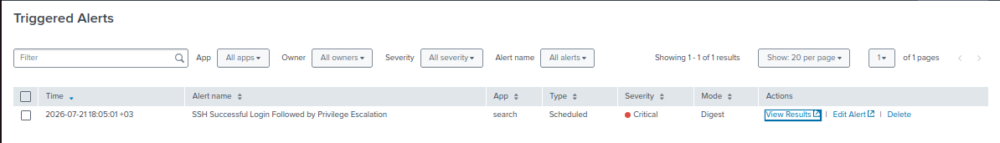

## Evidence Summary

| Evidence | Status |
|---|---|
| Virtual lab architecture | Documented |
| Linux log ingestion | Verified |
| Raw SSH events | Verified |
| SPL detection logic | Validated |
| Scheduled alert configuration | Validated |
| Alert triggering | Confirmed |
| SOC dashboard | Documented |
| Initial brute-force investigation | No successful authentication observed |
| Failure-to-success authentication sequence | Confirmed |
| SSH failure-to-success raw events | Verified |
| Failure-to-success correlation detection | Validated |
| SSH privilege-escalation correlation | Validated |
| Critical privilege-escalation alert | Confirmed |
| Positive and negative validation tests | Passed |
| Multiple escalation sequences | Verified |
| Duplicate-alert suppression | Verified |

## Privacy and Safety Notice

The displayed IP addresses belong to the isolated virtual lab network.

No passwords, authentication tokens, public targets, production systems, or unauthorized devices are included in this project.

## SOC Alert Automation Evidence

The following screenshots document the end-to-end SOC alert automation implemented using Splunk, n8n, and Telegram.

### 13. n8n Container Running

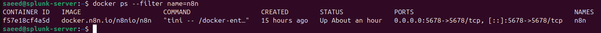

Demonstrates that the n8n Docker container is running successfully and exposing TCP port `5678`.

---

### 14. n8n Web Interface

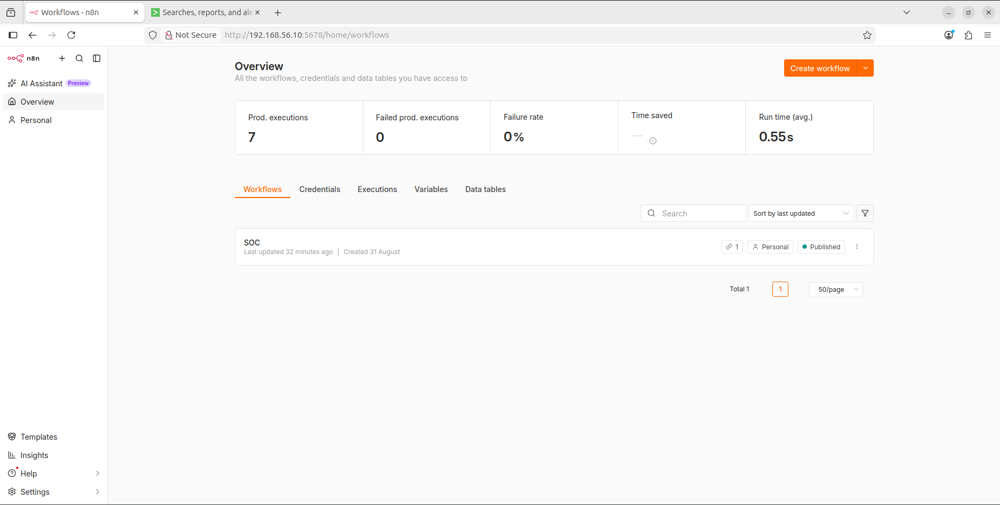

Confirms that the n8n application is accessible and operational inside the Mini SOC lab.

---

### 15. Splunk Webhook Alert Action

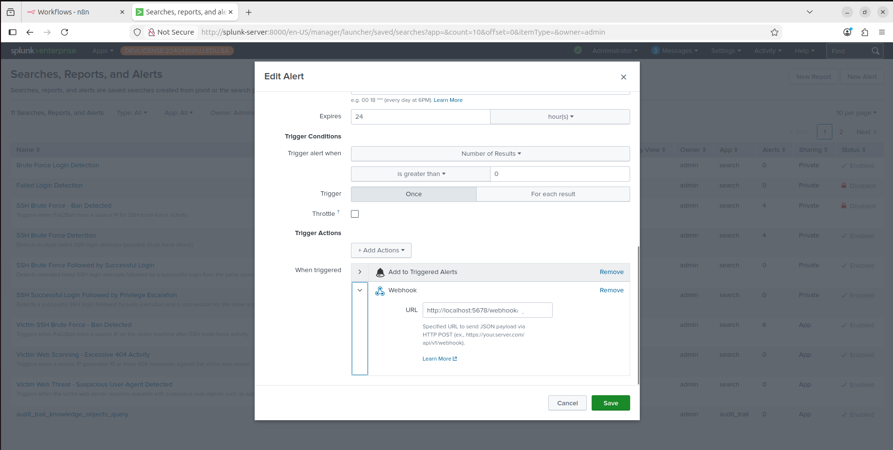

Shows the Splunk alert configured with a Webhook alert action used to forward triggered security alerts to n8n.

Sensitive portions of the webhook endpoint should be redacted before publication.

---

### 16. n8n Webhook Reception

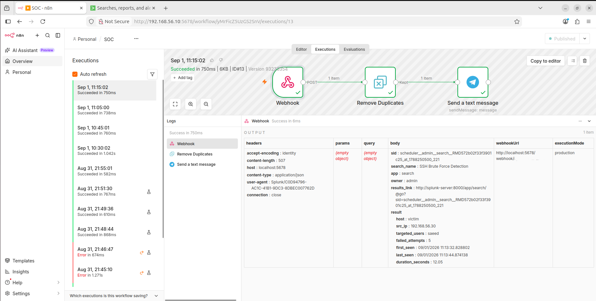

Shows the n8n Webhook node successfully receiving alert data from Splunk.

---

### 17. n8n Workflow Execution

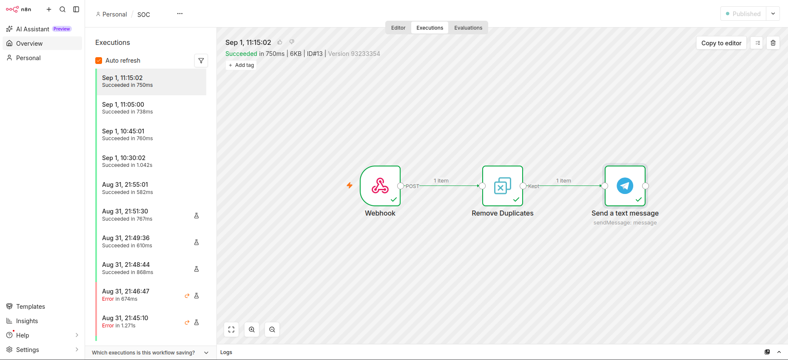

Shows the successful execution of the SOC automation workflow.

The implemented workflow is:

```text
Webhook
   |
   v
Remove Duplicates
   |
   v
Telegram
```

---

### 18. Duplicate Filtering

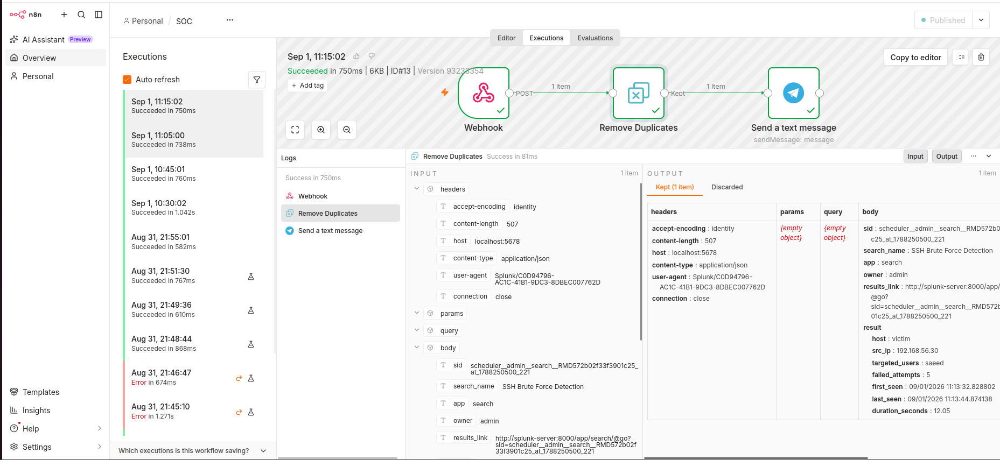

Shows the duplicate filtering stage used to reduce unnecessary repeated alert processing.

---

### 19. Telegram Node Execution

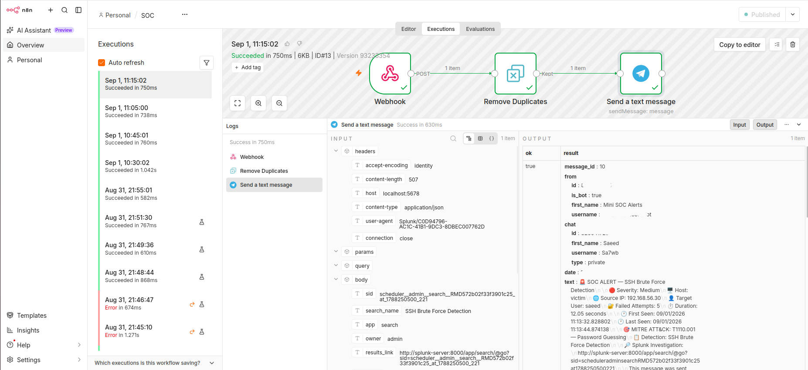

Shows the Telegram node executing successfully after the Splunk alert is processed by n8n.

---

### 20. Telegram SOC Alert

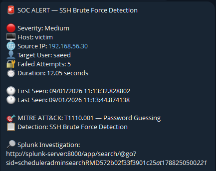

Shows the final SOC notification successfully delivered to the analyst through Telegram.

This screenshot confirms the complete automation chain:

```text
Splunk Detection
      |
      v
Splunk Alert
      |
      v
Webhook
      |
      v
n8n
      |
      v
Duplicate Filtering
      |
      v
Telegram
      |
      v
SOC Analyst
```

## Automation Validation Result

| Evidence | Status |
|---|---|
| n8n running | Validated |
| n8n interface accessible | Validated |
| Splunk webhook configured | Validated |
| Webhook received by n8n | Validated |
| Workflow executed | Validated |
| Duplicate filtering executed | Validated |
| Telegram node executed | Validated |
| SOC alert received in Telegram | Validated |

The evidence confirms successful end-to-end alert automation from Splunk detection to external analyst notification.

---

## Use Case 04 — Multiple Failed sudo Attempts

The following screenshots document the complete validation workflow for **Use Case 04 — Multiple Failed sudo Attempts**.

All screenshots for this use case are stored in:

```text
use-cases/phase-01-ssh-authentication/uc-04-failed-sudo/evidence/
```

### 1. Failed sudo Attempts — Event Generation

Shows the controlled generation of three incorrect sudo password attempts on the Linux victim host.

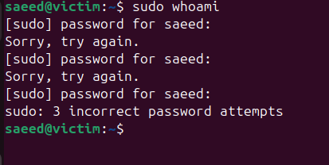

### 2. Raw sudo Event in Splunk

Confirms that the generated sudo authentication event was successfully ingested from `/var/log/auth.log`.

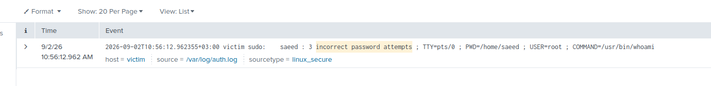

### 3. SPL Detection Result

Shows the SPL detection extracting the affected host, user, and number of failed sudo authentication attempts.


### 4. Detection Threshold Validation

Confirms that the detection threshold `failed_attempts >= 3` successfully identified the simulated activity.

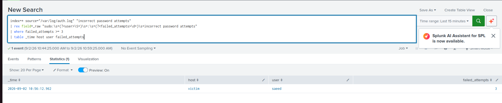

### 5. Alert Configuration

Shows the final scheduled Splunk alert configuration, including the five-minute schedule, search window, trigger condition, Medium severity, and Triggered Alerts action.


### 6. Alert Saved Successfully

Confirms that the scheduled Splunk alert was successfully saved.


### 7. Triggered Alert

Shows the alert successfully appearing in Splunk Triggered Alerts after the controlled sudo authentication failures.


### 8. Triggered Alert Result

Shows the triggered detection result containing the expected host, user, and failed-attempt count.


### 9. sudo Authentication Investigation

Documents the investigation of related sudo authentication failures associated with the detected user and host.


### 10. No Successful sudo Session

Shows the investigation search returning zero events for a successful root sudo session during the investigated time window.

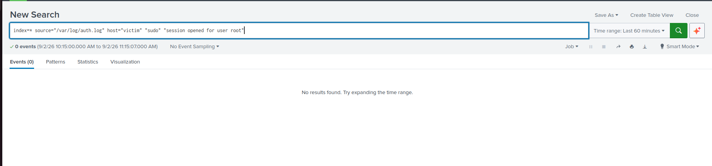

### Use Case 04 Evidence Summary

| Evidence | Status |
|---|---|
| Controlled sudo failure generation | Verified |
| Linux authentication log ingestion | Verified |
| SPL field extraction | Validated |
| Detection threshold | Validated |
| Scheduled alert configuration | Validated |
| Alert creation | Confirmed |
| Triggered alert | Confirmed |
| Triggered detection fields | Verified |
| sudo authentication investigation | Completed |
| Successful privileged session check | No successful session observed |

**Use Case 04 Evidence Status: COMPLETE**

## Use Case 05 — Evidence Index

[Open all 16 UC-05 evidence files](../use-cases/phase-01-ssh-authentication/uc-05-privileged-login/evidence/README.md).
