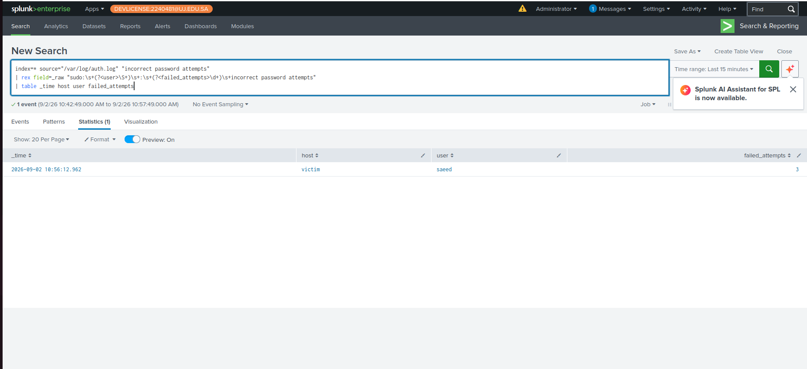
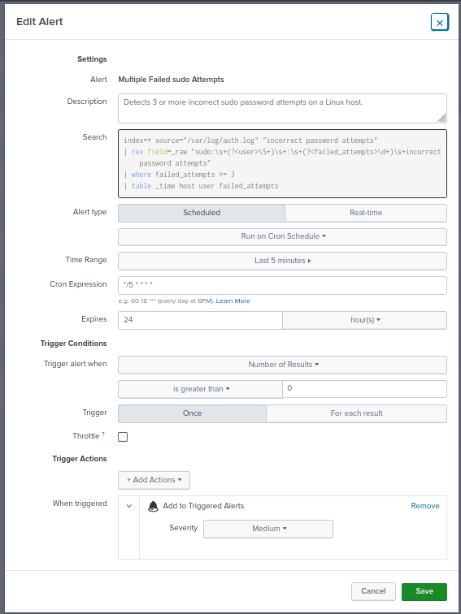
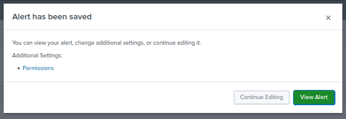
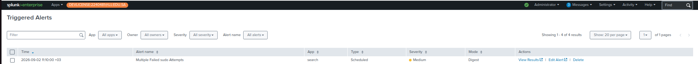
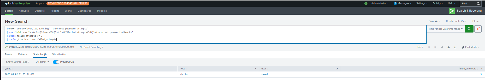
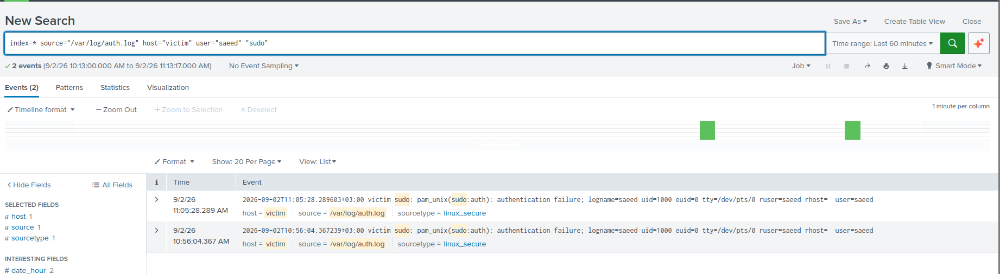

# Use Case 04 — Multiple Failed sudo Attempts

## Overview

This use case detects repeated failed `sudo` authentication attempts on a Linux host.

Repeated incorrect sudo password attempts may indicate an attempt to obtain elevated privileges using a local account. The detection monitors Linux authentication events ingested into Splunk from `/var/log/auth.log`.

The use case was validated in the Mini SOC lab using a controlled simulation of three consecutive incorrect sudo password attempts.

---

## Objective

The objective of this use case is to:

- Detect repeated failed `sudo` authentication attempts.
- Identify the affected Linux host and user.
- Extract the number of failed sudo password attempts.
- Generate a Splunk alert when three or more incorrect password attempts are observed.
- Investigate whether the failed attempts were followed by a successful sudo session.
- Map the activity to the appropriate MITRE ATT&CK technique.
- Document the detection and investigation with supporting evidence.

---

## Environment

| Component | Value |
|---|---|
| SIEM | Splunk Enterprise |
| Operating System | Ubuntu Linux |
| Victim Host | `victim` |
| Test User | `saeed` |
| Log Source | `/var/log/auth.log` |
| Sourcetype | `linux_secure` |

---

## Attack Simulation

The activity was generated from the Linux victim host in the authorized SOC lab environment.

First, the cached sudo credentials were invalidated:

```bash
sudo -k
```

The following command was then executed:

```bash
sudo whoami
```

Three incorrect passwords were entered when prompted.

The terminal returned:

```text
sudo: 3 incorrect password attempts
```

This generated sudo authentication failure activity in `/var/log/auth.log`.

---

## Log Ingestion Validation

The generated sudo event was successfully ingested into Splunk from:

```text
/var/log/auth.log
```

The relevant raw event contained:

```text
sudo: saeed : 3 incorrect password attempts ; TTY=pts/0 ; PWD=/home/saeed ; USER=root ; COMMAND=/usr/bin/whoami
```

The event provided the information required for detection and investigation, including:

- Host: `victim`
- User: `saeed`
- Failed attempts: `3`
- Requested account: `root`
- Command: `/usr/bin/whoami`

---

## Detection Logic

The following SPL was used to detect the activity:

```spl
index=* source="/var/log/auth.log" "incorrect password attempts"
| rex field=_raw "sudo:\s+(?<user>\S+)\s+:\s+(?<failed_attempts>\d+)\s+incorrect password attempts"
| where failed_attempts >= 3
| table _time host user failed_attempts
```

### Detection Logic Explanation

The search:

1. Searches Linux authentication logs for events containing `incorrect password attempts`.
2. Extracts the username into the `user` field.
3. Extracts the number of incorrect password attempts into `failed_attempts`.
4. Filters the results to events where `failed_attempts >= 3`.
5. Displays the timestamp, host, user, and number of failed attempts.

---

## Detection Threshold

The detection threshold is:

```text
failed_attempts >= 3
```

An event is considered relevant when three or more incorrect sudo password attempts are recorded.

---

## Detection Output

The controlled simulation generated the following detection result:

| Field | Observed Value |
|---|---|
| Host | `victim` |
| User | `saeed` |
| Failed Attempts | `3` |

The SPL successfully identified the simulated sudo authentication failures.

---

## Positive Validation

A positive test was performed by executing:

```bash
sudo -k
sudo whoami
```

Three incorrect passwords were entered.

Splunk recorded:

```text
3 incorrect password attempts
```

The detection returned a result because:

```text
failed_attempts = 3
```

which satisfied:

```text
failed_attempts >= 3
```

The scheduled Splunk alert subsequently triggered successfully.

**Result: PASS**

---

## Negative / Escalation Validation

The investigation also checked whether the failed sudo attempts were followed by a successful privileged session.

The following SPL was used:

```spl
index=* source="/var/log/auth.log" host="victim" "sudo" "session opened for user root"
```

The search returned:

```text
0 events
```

No successful sudo session was identified during the investigated time window.

This indicates that the simulated failed authentication attempts did not result in successful privilege escalation.

**Result: PASS**

---

## Validation Matrix

| Test | Expected Result | Actual Result | Status |
|---|---|---|---|
| Three incorrect sudo passwords | Detection generated | Detection generated | PASS |
| `failed_attempts >= 3` | Event retained by SPL | Event retained | PASS |
| Scheduled alert execution | Alert triggered | Alert triggered | PASS |
| Successful sudo session check | No successful session | `0 events` | PASS |

---

## Alert Validation

A scheduled Splunk alert named:

```text
Multiple Failed sudo Attempts
```

was configured using the validated detection query.

The alert was configured to:

- Run every 5 minutes.
- Search the previous 5 minutes.
- Trigger when the number of results is greater than `0`.
- Trigger once per scheduled execution.
- Use `Medium` severity.
- Add the detection to Splunk Triggered Alerts.

After generating another controlled set of three incorrect sudo password attempts, the alert appeared successfully in **Triggered Alerts**.

The triggered alert results showed:

```text
host = victim
user = saeed
failed_attempts = 3
```

This confirmed that the scheduled detection workflow operated successfully from log generation through alert generation.

---

## Investigation

After the alert triggered, related sudo authentication activity was reviewed.

The following SPL was used to isolate sudo-related events:

```spl
index=* source="/var/log/auth.log" host="victim" user="saeed" "sudo"
```

The investigation identified sudo authentication failures associated with:

```text
Host: victim
User: saeed
```

The relevant activity showed repeated authentication failures associated with the controlled test.

A separate search was then performed to identify evidence of a successful sudo session:

```spl
index=* source="/var/log/auth.log" host="victim" "sudo" "session opened for user root"
```

The result was:

```text
0 events
```

No evidence of a successful sudo session was identified during the investigated time window.

---

## Investigation Findings

The investigation established that:

- Multiple failed `sudo` authentication attempts occurred.
- The affected host was `victim`.
- The associated user was `saeed`.
- Three incorrect sudo password attempts were recorded.
- The requested elevated account was `root`.
- The attempted command was `/usr/bin/whoami`.
- Splunk successfully ingested the authentication event.
- The SPL detection successfully identified the activity.
- The configured detection threshold was reached.
- The scheduled Splunk alert triggered successfully.
- No successful sudo session was identified during the investigated time window.
- No evidence of successful privilege escalation was identified.
- The activity was generated as part of an authorized SOC lab simulation.

---

## MITRE ATT&CK Mapping

| Field | Mapping |
|---|---|
| Tactic | Privilege Escalation |
| Technique | T1548 — Abuse Elevation Control Mechanism |
| Sub-technique | T1548.003 — Sudo and Sudo Caching |

`sudo` is an elevation control mechanism on Unix and Linux systems. Attempts to use sudo to execute commands with elevated privileges align with **T1548.003 — Sudo and Sudo Caching**.

---

## Analyst Assessment

The detected activity represented repeated attempts to authenticate through `sudo` for elevated command execution.

The configured detection successfully identified the activity after three incorrect password attempts.

Investigation found no evidence that the attempts resulted in a successful sudo session or successful privilege escalation.

Because the activity was generated intentionally as part of the authorized Mini SOC lab validation, no containment or remediation action was required.

In a production environment, similar activity would require validation of the user, source host, attempted command, surrounding authentication activity, and any subsequent successful privileged sessions.

---

## Evidence Collected

The following evidence was collected during validation:

1. Controlled generation of three failed sudo password attempts.
2. Raw sudo authentication event ingested into Splunk.
3. SPL field extraction showing `host`, `user`, and `failed_attempts`.
4. Detection threshold validation using `failed_attempts >= 3`.
5. Final scheduled alert configuration.
6. Confirmation that the Splunk alert was saved successfully.
7. Successful appearance of the alert in Triggered Alerts.
8. Triggered alert result showing the detected user and failed attempts.
9. Investigation of related sudo authentication failures.
10. Search confirming no successful sudo session during the investigated time window.

---

### Evidence Screenshots

#### 1. Failed sudo Attempts — Event Generation


#### 2. Raw sudo Event Ingested into Splunk


#### 3. SPL Detection Result



#### 4. Detection Threshold Validation


#### 5. Alert Configuration



#### 6. Alert Saved Successfully



#### 7. Triggered Alert



#### 8. Triggered Alert Result



#### 9. sudo Authentication Investigation



#### 10. No Successful sudo Session


## Result

**Detection Status: PASS**

**Alert Status: PASS**

**Investigation Status: PASS**

The use case successfully demonstrated detection and investigation of repeated failed sudo authentication attempts using Linux authentication logs and Splunk.
