# UC5 — Successful Login to a Privileged or Sensitive Account

## Overview

This use case detects successful SSH authentication to Linux accounts classified as privileged or sensitive.

The detection uses a Splunk lookup file to maintain the list of privileged accounts instead of hardcoding usernames directly into the SPL query.

This makes the detection easier to maintain and extend as additional sensitive accounts are identified.

## Objective

Detect successful SSH authentication to accounts that have elevated privileges or are otherwise considered sensitive.

The use case is designed to help identify potentially unauthorized access to privileged Linux accounts.

## Data Source

- Log file: `/var/log/auth.log`
- Splunk sourcetype: `linux_secure`
- Monitored host: `victim`
- Authentication service: SSH

## Detection Scope

The detection monitors successful SSH authentication events using either:

- Password authentication
- Public-key authentication

Only accounts present in the `privileged_accounts.csv` lookup are treated as privileged or sensitive.

## Privileged Account Lookup

The following lookup is used:

```text
lookups/privileged_accounts.csv
```

Example contents:

```csv
user,account_type,severity
saeed,Privileged Account (sudo),High
root,Sensitive Account (root),Critical
```

The `saeed` account was verified as a member of the Linux `sudo` group before testing.

## Detection Logic

The detection:

1. Searches Linux authentication logs for successful SSH authentication.
2. Extracts:
   - Authentication method
   - Username
   - Source IP
   - Source port
3. Matches the authenticated username against the privileged account lookup.
4. Keeps only accounts classified as privileged or sensitive.
5. Returns the relevant investigation fields and assigned severity.

## SPL Detection

```spl
index=* host="victim" sourcetype="linux_secure"
("Accepted password for" OR "Accepted publickey for")
| rex field=_raw "Accepted (?<auth_method>\S+) for (?<user>\S+) from (?<src_ip>\d{1,3}(?:\.\d{1,3}){3}) port (?<src_port>\d+)"
| lookup privileged_accounts.csv user OUTPUT account_type severity
| where isnotnull(account_type)
| table _time host user account_type src_ip src_port auth_method severity
| sort - _time
```

## Controlled Test Scenario

A controlled SSH login was performed from the Kali Linux attacker machine to the privileged `saeed` account on the victim system.

Connection:

```text
Kali
  |
  | SSH
  v
victim
```

Target:

```text
saeed@192.168.56.20
```

Source IP:

```text
192.168.56.30
```

The login was completed successfully using password authentication.

## Raw Log Evidence

The victim authentication log recorded the successful SSH login:

```text
Accepted password for saeed from 192.168.56.30 port 53204 ssh2
```

The same event was successfully ingested into Splunk.

## Positive Test

The privileged account `saeed` was used for a successful SSH login.

Expected result:

- Event is ingested into Splunk.
- Username matches the privileged account lookup.
- Detection returns a result.
- Severity is assigned as `High`.

Result:

**Passed**

## Negative Test

A separate local account named `soc-test` was verified as a non-privileged account.

The account was not a member of the `sudo` group.

A successful SSH login was then performed using `soc-test`.

Raw log:

```text
Accepted password for soc-test from 192.168.56.30 port 37754 ssh2
```

Splunk successfully ingested the login event.

However, because `soc-test` does not exist in the privileged account lookup, it was excluded from the UC5 detection results.

Result:

**Passed**

## Alert Configuration

A scheduled Splunk alert was configured using the validated detection.

Configuration:

- Alert type: Scheduled
- Schedule: Every 5 minutes
- Cron expression: `*/5 * * * *`
- Search window: Last 5 minutes
- Trigger condition: Number of Results > 0
- Trigger mode: For each result
- Severity: High
- Throttle: Enabled
- Suppression period: 15 minutes
- Suppression fields:
  - `user`
  - `src_ip`
- Trigger action: Add to Triggered Alerts

The suppression configuration reduces duplicate notifications for repeated events involving the same user and source IP while allowing different privileged-account events to generate independent alerts.

## Alert Validation

A new successful SSH login was generated to the `saeed` privileged account.

The scheduled search detected the event and successfully added the alert to the Splunk Triggered Alerts interface.

Triggered alert result:

- User: `saeed`
- Host: `victim`
- Account Type: Privileged Account (sudo)
- Source IP: `192.168.56.30`
- Source Port: `55576`
- Authentication Method: `password`
- Severity: `High`

Alert validation result:

**Passed**

## Investigation

The triggered event was investigated using surrounding authentication and sudo activity.

The investigation confirmed:

- Successful authentication to the privileged `saeed` account.
- Source IP was `192.168.56.30`.
- No failed password attempts for `saeed` were observed immediately before the detected login.
- No sudo activity associated with the detected SSH session was observed after the login.
- The SSH session was short and disconnected shortly after successful authentication.
- Other sudo activity visible in the wider time range was related to controlled lab administration and previous validation activity.

## Investigation Conclusion

**True Positive — Authorized / Expected Activity**

The detection correctly identified the successful login to a privileged account.

The authentication activity was intentionally generated as part of the controlled Mini SOC lab and was therefore authorized.

## MITRE ATT&CK Mapping

### Primary

- Technique: Valid Accounts
- Sub-technique: Local Accounts
- ID: `T1078.003`
- Tactics:
  - Initial Access
  - Persistence
  - Privilege Escalation
  - Defense Evasion

### Related

- Technique: Remote Services
- Sub-technique: SSH
- ID: `T1021.004`
- Tactic: Lateral Movement

## Indicators

| Indicator | Value |
|---|---|
| Source IP | `192.168.56.30` |
| Privileged User | `saeed` |
| Host | `victim` |
| Authentication Method | `password` |

## Response Recommendations

If this detection occurred in a production environment:

1. Confirm whether the privileged login was expected.
2. Verify the identity of the user associated with the account.
3. Review commands and activity performed during the session.
4. Search for failed authentication attempts before the login.
5. Review sudo and privilege-escalation activity after authentication.
6. Investigate the source IP for related activity.
7. Disable or restrict the account if unauthorized access is suspected.
8. Reset credentials and revoke active sessions if compromise is confirmed.

## Validation Status

- Privileged account verified: ✅
- Controlled successful login generated: ✅
- Raw authentication log verified: ✅
- Splunk ingestion verified: ✅
- SPL detection validated: ✅
- Lookup-based classification validated: ✅
- Positive test passed: ✅
- Negative test passed: ✅
- Scheduled alert configured: ✅
- Alert triggered successfully: ✅
- Investigation completed: ✅
- MITRE ATT&CK mapping completed: ✅
- Incident report completed: ✅
- Screenshots captured: ✅

## Validation Evidence

The following screenshots document the complete UC5 validation workflow.

### Privileged Account Verification

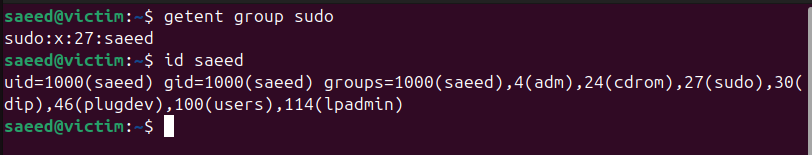

### Successful Privileged SSH Login

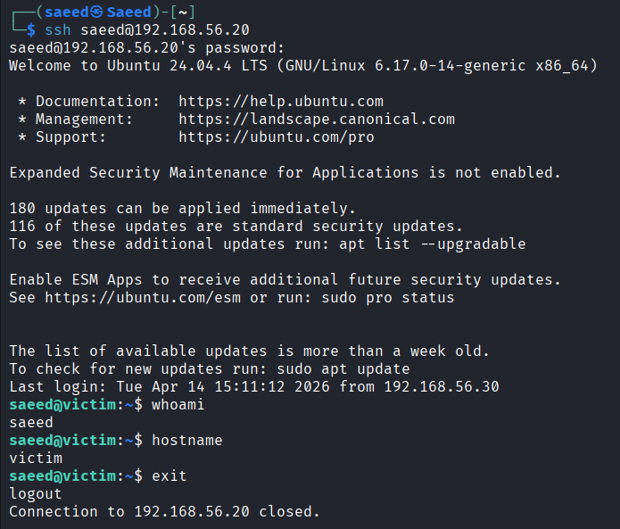

### Raw Authentication Log

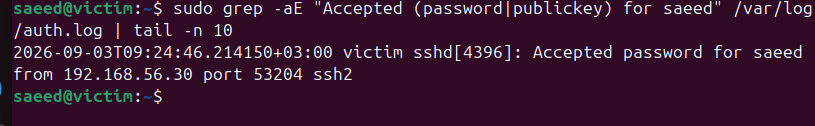

### Splunk Log Ingestion


### Non-Privileged Account Verification

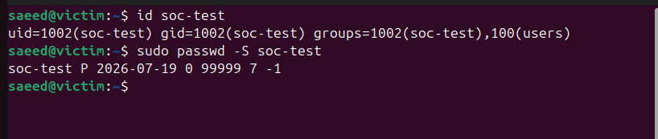

### Negative Test — Successful SSH Login


### Negative Test — Raw Authentication Log

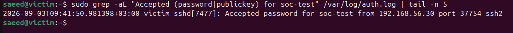

### Negative Test — Splunk Ingestion


### Negative Test — Detection Validation

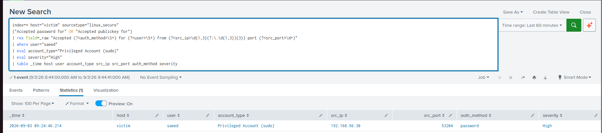

### Privileged Accounts Lookup

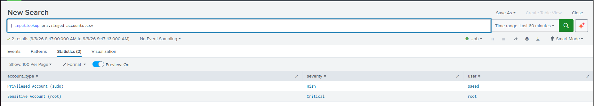

### Final Detection Results

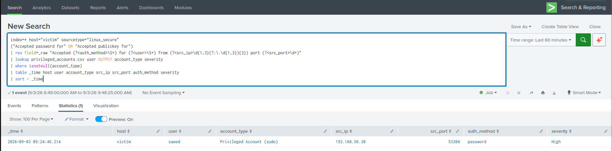

### Alert Configuration

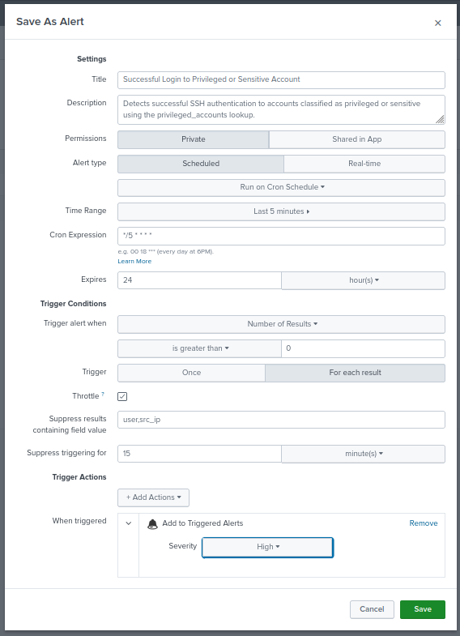

### Triggered Alert

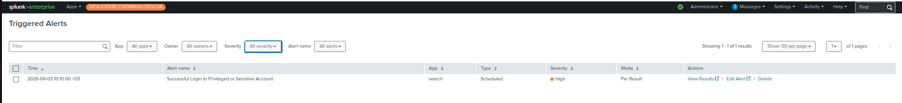

### Triggered Alert Results

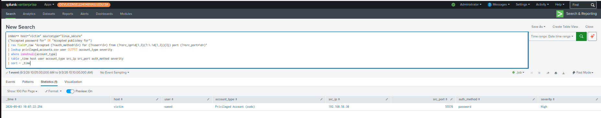

### Investigation Timeline

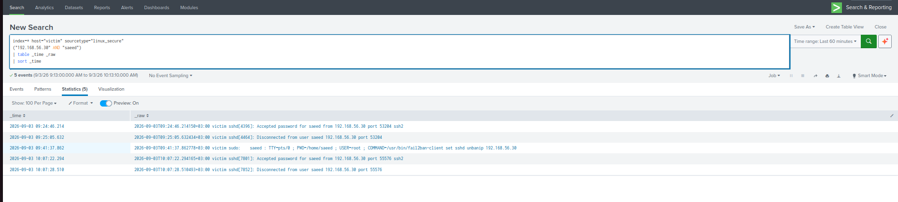

### Investigation Context


## Final Status

**Validated**
