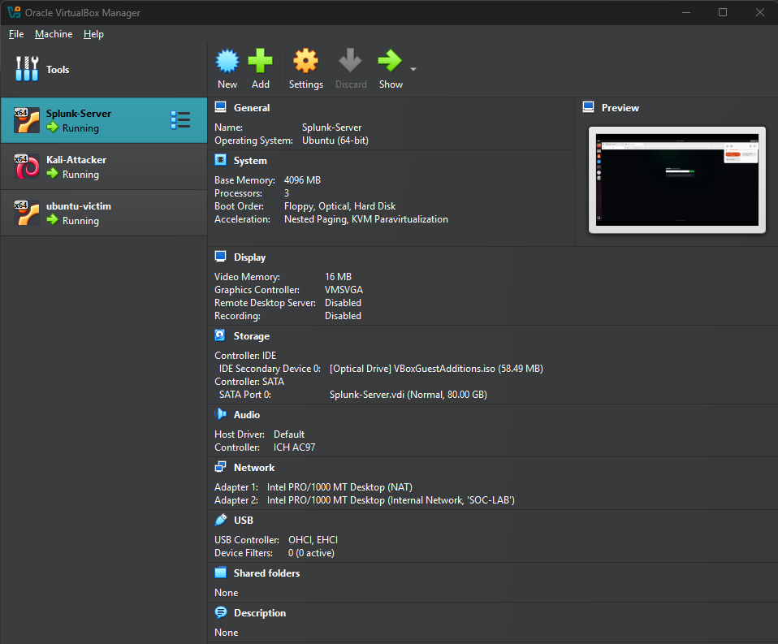
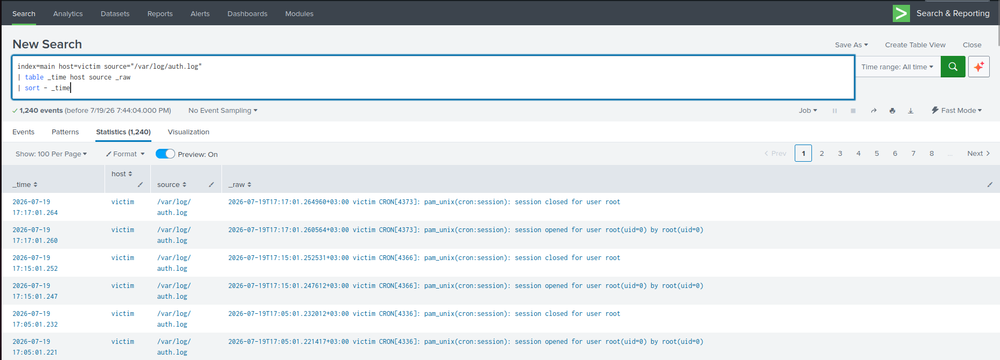
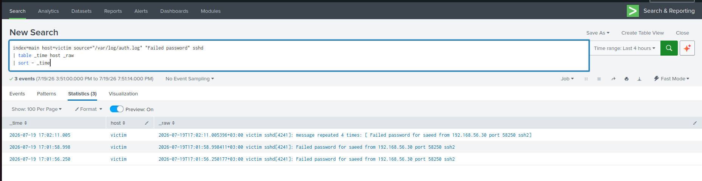
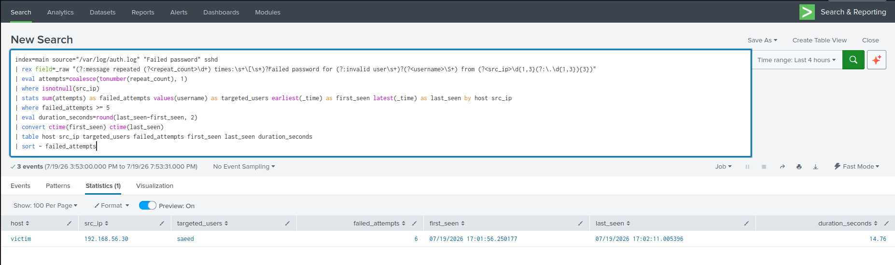
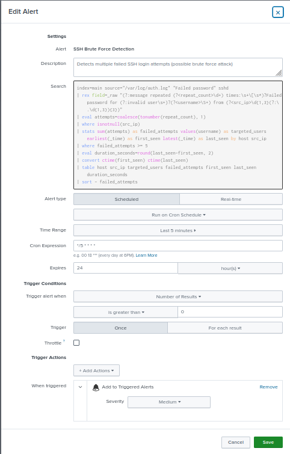
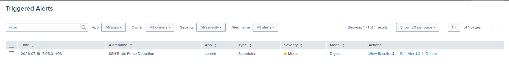
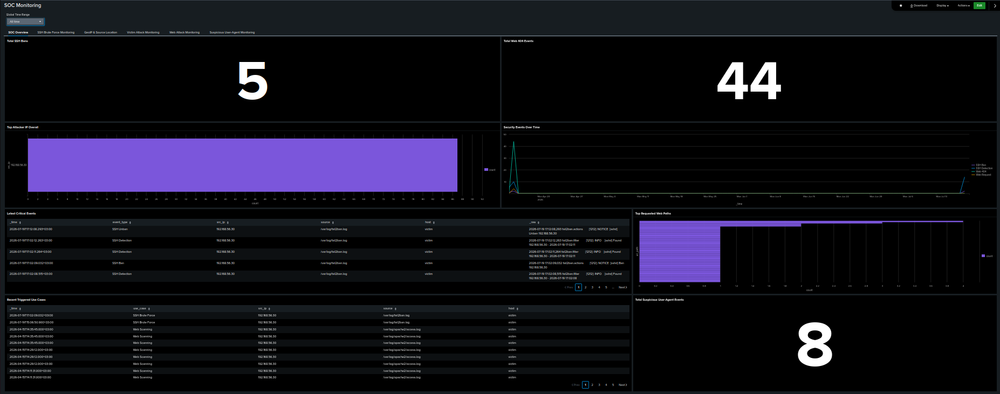
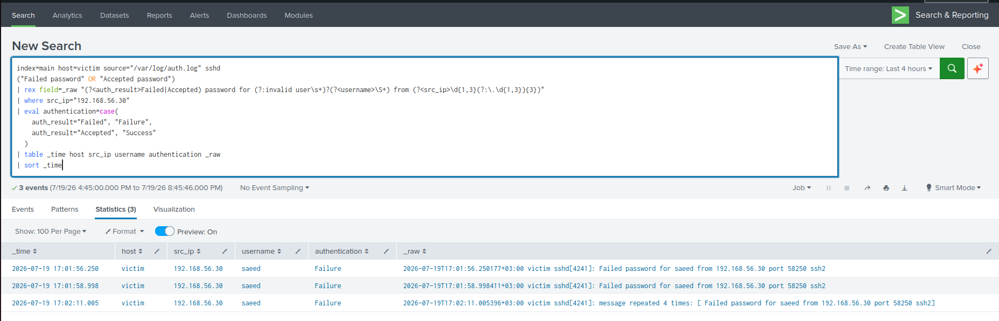

# Project Screenshots

This directory contains visual evidence documenting the Mini SOC lab architecture, Splunk log ingestion, SSH brute-force detection, alert validation, investigation, and monitoring dashboard.

All displayed activity was generated inside an isolated and authorized lab environment.

## 1. Lab Virtual Machines

The VirtualBox environment includes the Splunk Server, Kali Linux attacker machine, and Ubuntu victim machine connected through the isolated `SOC-LAB` network.

## 2. Splunk Log Ingestion

Linux authentication logs from the monitored victim machine are successfully collected and indexed in Splunk Enterprise.

## 3. Raw SSH Brute-Force Events

Raw Linux authentication events show failed SSH passwords originating from the Kali Linux source address.

The logs include normal events and a compressed `message repeated` event.

## 4. Detection Query Results

The validated SPL query extracts the source IP and targeted username, calculates repeated events, and identifies six failed authentication attempts.

## 5. Alert Configuration

The Splunk alert is scheduled to run every five minutes and searches the previous five-minute window.

It triggers when the detection query returns one or more results and records the alert with Medium severity.

## 6. Triggered Alert

The validated SSH brute-force alert appeared successfully in the Splunk Triggered Alerts page.

## 7. SOC Monitoring Dashboard

The SOC monitoring dashboard provides visibility into SSH detections, defensive blocks, web activity, suspicious user agents, source addresses, and recent security events.

## 8. Investigation Evidence

The investigation search confirms that the tested source IP generated failed authentication events and that no successful SSH password authentication was observed during the test window.

## Evidence Summary

| Evidence | Status |
|---|---|
| Virtual lab architecture | Documented |
| Linux log ingestion | Verified |
| Raw SSH events | Verified |
| SPL detection logic | Validated |
| Scheduled alert configuration | Validated |
| Alert triggering | Confirmed |
| SOC dashboard | Documented |
| Successful-login review | No successful authentication observed |

## Privacy and Safety Notice

The displayed IP addresses belong to the isolated virtual lab network.

No passwords, authentication tokens, public targets, production systems, or unauthorized devices are included in this project.
